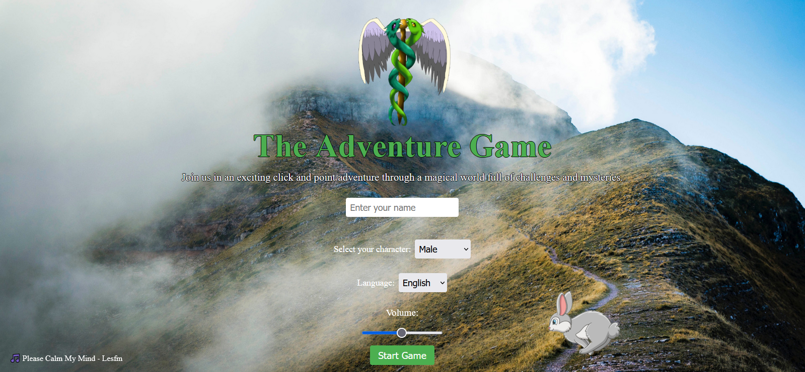
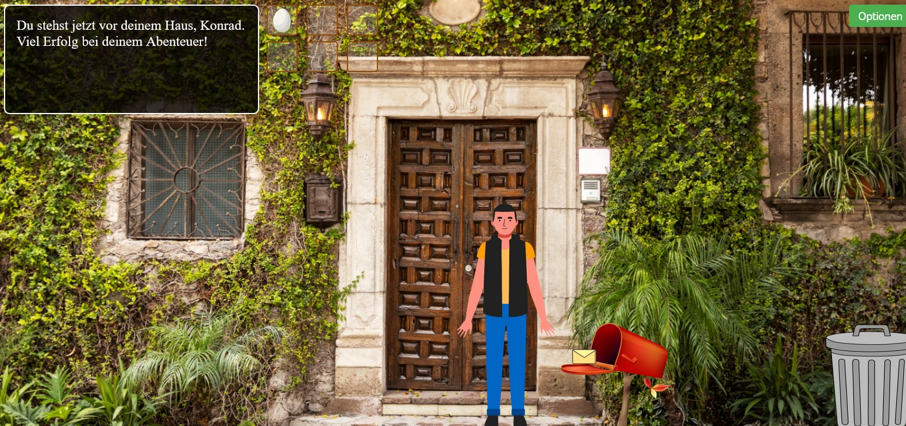

# 🎮 [TheAdventureGame1.0](https://github.com/KonradReyhe/TheAdventureGame1.0)

Ein Point-and-Click-Abenteuerspiel als Lernprojekt in HTML, CSS und JavaScript, integriert mit ChatGPT-4.0. Begib dich auf eine geheimnisvolle Reise, interagiere mit deiner Umgebung und entdecke die in diesem Spiel verborgenen Geheimnisse.

A point-and-click adventure game designed as a learning project in HTML, CSS, and JavaScript, integrated with ChatGPT-4.0. Embark on a mysterious journey, interact with your surroundings, and discover the secrets hidden within.

## Wie man spielt | How to Play

Beginnen Sie das Abenteuer, indem Sie dem folgenden Link folgen: [TheAdventureGame1.0](https://konradreyhe.github.io/TheAdventureGame1.0/)

Kick off the adventure by following this link: [TheAdventureGame1.0](https://konradreyhe.github.io/TheAdventureGame1.0/)

## Screenshot vom Startbildschirm | Starting Screen Screenshot

## Screenshot vom Heimatszene | Home Scene Screenshot

## Funktionen | Features

- **Interaktiver Startbildschirm | Interactive Start Screen:** Wähle die Sprache (Englisch oder Deutsch), wähle deinen Charakter, stelle die Lautstärke ein und starte das Spiel. Choose the language (English or German), select your character, adjust the volume, and start the game.

### Heimatszene | Home Scene

Der Charakter erscheint vor seinem Zuhause. Öffne und inspiziere den Mülleimer. Nimm einen geheimnisvollen Brief aus dem Briefkasten. Wenn der Brief ins Inventar genommen und geöffnet wird, erscheint ein Button, um zur nächsten Szene zu gelangen.

Character spawns in front of their home. Open and inspect the trashcan. Pick up a mysterious letter from the mailbox. Once taken into the inventory and opened, a button to progress to the next scene is activated.

### Waldpfad Szene | Forest Path Scene

Nimm eine Karotte auf. (Bitte beachten: Der Fortschritt nach dieser Szene wurde noch nicht entwickelt.)

Pick up a carrot. (Please note: Progression beyond this scene has not been developed yet.)

## Zukünftige Entwicklungen | Future Developments

1. **Szene mit dem alten Mann:** Der Spieler wird auf einen weisen alten Mann treffen, der Hinweise und Rätsel gibt, die dem Spieler helfen, die nächste Phase des Spiels zu erreichen.

   - **Scene with the Old Man:** The player will encounter a wise old man, providing hints and puzzles that assist the player in reaching the next phase of the game.

2. **Weitere Reise:** Nach der Begegnung mit dem alten Mann wird der Spieler eine Reihe von Interaktionen mit verschiedenen NPCs, Gegenständen und Aufgaben erleben, die die Geschichte weiter vorantreiben.
   - **Continued Journey:** After the encounter with the old man, the player will experience a series of interactions with various NPCs, objects, and tasks that further advance the story.

## Entwicklungsziel | Development Purpose

Seit Februar 2023 mache ich eine Umschulung zum Anwendungsentwickler, die im Februar 2025 abgeschlossen sein wird. Dieses Spiel wurde in erster Linie als praktisches Projekt entwickelt, um:

- Die Grundlagen und Feinheiten von HTML, CSS und JavaScript zu erlernen.
- Den Problemlösungsprozess in der Spielentwicklung zu verstehen.
- Mit OpenAI's ChatGPT4.0 zu experimentieren.

I've been undergoing retraining as an application developer since February 2023, which will conclude in February 2025. This game was primarily developed as a hands-on project to:

- Understand the basics and nuances of HTML, CSS, and JavaScript.
- Grasp the problem-solving process in game development.
- Experiment with OpenAI's ChatGPT4.0.

Obwohl ich durch dieses Projekt wertvolle Erfahrungen in der Spieleentwicklung gesammelt habe, liegt mein Hauptinteresse und meine berufliche Zielsetzung im Bereich der FrontEnd-JavaScript-Entwicklung. Ich würde es bevorzugen, als JavaScript FrontEnd Entwickler zu arbeiten und bin aktuell auf der Suche nach passenden Möglichkeiten in diesem Bereich. Ich wohne in Deutschland und bewerbe mich bei deutschen Unternehmen.

While this project has given me valuable insights into game development, my primary interest and career goal lie in FrontEnd JavaScript development. I have a preference to work as a JavaScript FrontEnd Developer and am currently looking for suitable opportunities in this field. I reside in Germany and am applying to German companies.

### Kontakt | Contact

📧 Email: [kreyhe@yahoo.com](mailto:kreyhe@yahoo.com)
🔗 LinkedIn: [Konrad Reyhe](https://www.linkedin.com/in/konrad-reyhe-6a055b293/)

## Credits

- **Envelope/Briefumschlag:**
  - [Vecteezy](https://de.vecteezy.com/vektorkunst/425300-umschlag-ikonen-vektor-illustration)
- **Hintergrundbild/Background Image:**
  - [Freepik](https://www.freepik.com/free-photo/colorful-mexican-architecture-urban-landscape_32520236.htm#query=italian%20garden&position=20&from_view=keyword&track=ais)
  - [Pexels](https://www.pexels.com/de-de/foto/wolkenbedeckter-berggipfel-auf-landschaftsfotografie-655679/)
- **Egg/Ei:**
  - [Vecteezy](https://de.vecteezy.com/png/10794334-ein-weisses-ei-png-datei)
- **Carrot/Karotte:**
  - [Flaticon](https://www.flaticon.com/de/kostenloses-icon/karotte_883760)
- **Mülleimer/Trashcan:**
  - [Pixabay](https://pixabay.com/de/vectors/m%C3%BClleimer-abfalleimer-papierkorb-6490105/)
- **Hase/Rabbit:**
  - [Freepik](https://de.freepik.com/vektoren-premium/cartoon-illustration-kaninchen-springt-und-laeuft-auf-der-suche-nach-nahrung-im-wald_29730868.htm)
- **Hintergrundmusik/Background Music:**
  - Please Calm My Mind - Lesfm
- **Männlicher Charakter-Sprite/Male Character-Sprite:**
  - [Freepik](https://de.freepik.com/vektoren-kostenlos/organic-flat-character-animation-frames-pack_13762400.htm)
- **Weiblicher Charakter-Sprite/Female Character-Sprite:**
  - [Pngtree](https://pngtree.com/freepng/pretty-young-woman-constructor-in-flat-style-parts-of-body-legs-and-arms-face-emotions-vector-cartoon-girl-character_7258981.html)

## Feedback und Mitarbeit | Feedback and Collaboration

Ihr Feedback macht den Unterschied! Haben Sie Vorschläge, finden Sie Fehler, oder möchten Sie beitragen? Zögern Sie nicht, ein Problem zu melden oder einen Pull Request zu erstellen.

Your feedback makes a difference! Have any suggestions, found bugs, or want to pitch in? Don't hesitate to report an issue or create a pull request.
